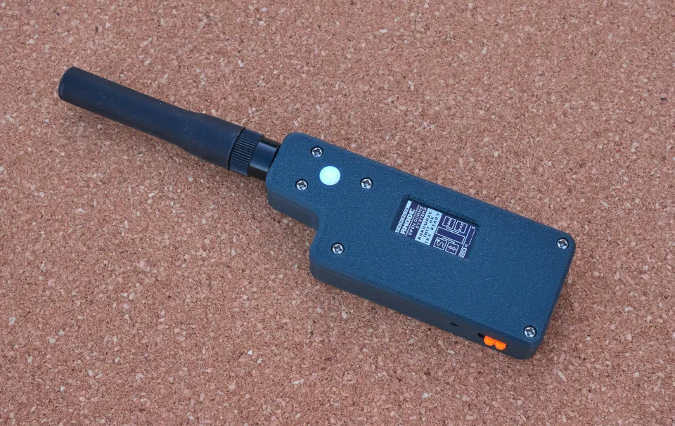
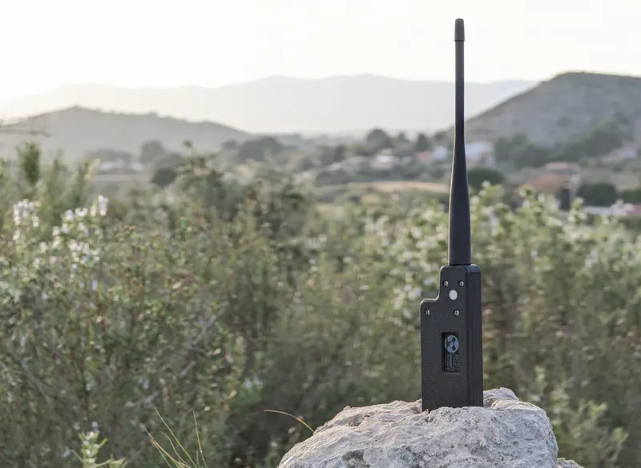
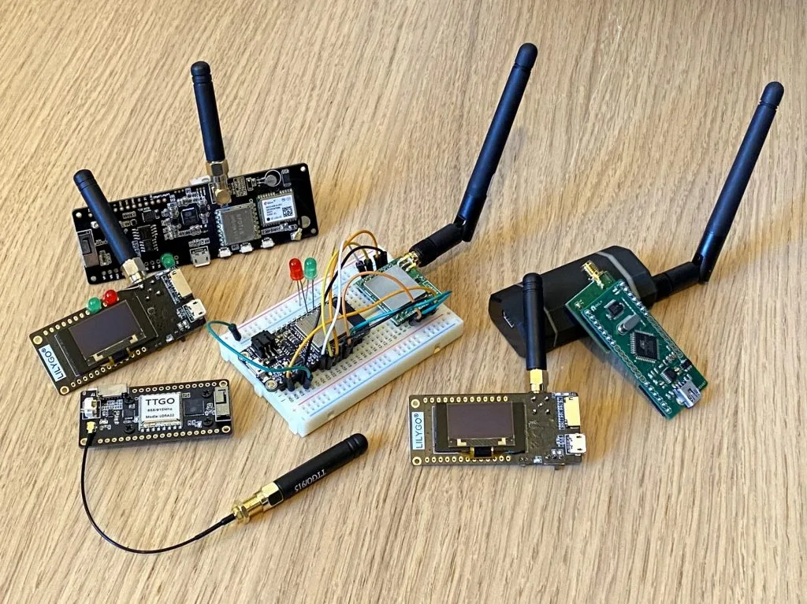

***Important!** This repository is currently functioning as a stable reference for the default RNode Firmware, and only receives bugfix and security updates. Further development, new features and expanded board support is now happening at the [RNode Firmware Community Edition](https://github.com/liberatedsystems/RNode_Firmware_CE) repository, and is maintained by [Liberated Embedded Systems](https://github.com/liberatedsystems). Thanks for all contributions so far!*

# RNode Firmware

This is the open firmware that powers RNode devices.

An RNode is an open, free and unrestricted digital radio transceiver. It enables anyone to send and receive any kind of data over both short and very long distances. RNodes can be used with many different kinds of programs and systems, but they are especially well suited for use with [Reticulum](https://reticulum.network).

RNode is not a product, and not any *one* specific device in particular. It is a system that is easy to replicate across space and time, that produces highly functional communications tools, which respects user autonomy and empowers individuals and communities to protect their sovereignty, privacy and ability to communicate and exchange data and ideas freely.



<center><i>An RNode made from readily available and cheap parts, in a durable 3D printed case</i></center><br/><br/>

The RNode system is primarily software, which *transforms* different kinds of available hardware devices into functional, physical RNodes, which can then be used to solve a wide range of communications tasks. Such RNodes can be modified and built to suit the specific time, locale and environment they need to exist in.

## Latest Release

The latest release, installable through `rnodeconf`, is version `1.81`. You must have at least version `2.4.0` of `rnodeconf` installed to update the RNode Firmware to version `1.81`. Get it by updating the `rns` package to at least version `0.9.0`.

## A Self-Replicating System

If you notice the presence of a circularity in the naming of the system as a whole, and the physical devices, it is no coincidence. Every RNode contains the seeds necessary to reproduce the system, the [RNode Bootstrap Console](https://unsigned.io/rnode_bootstrap_console), which is hosted locally on every RNode, and can be activated and accesses at any time - no Internet required.

The designs, guides and software stored within allows users to create more RNodes, and even to bootstrap entire communications networks, completely independently of existing infrastructure, or in situations where infrastructure has become unreliable or is broken.



<center><i>Where there is no Internet, RNodes will still communicate</i></center><br/><br/>

The production of one particular RNode device is not an end, but the potential starting point of a new branch of devices on the tree of the RNode system as a whole.

This tree fits into the larger biome of Free & Open Communications Systems, which I hope that you - by using communications tools like RNode - will help grow and prosper.

## One Tool, Many Uses

The RNode design is meant to flexible and hackable. At it's core, it is a low-power, but extremely long-range digital radio transceiver. Coupled with Reticulum, it provides encrypted and secure communications.

Depending on configuration, it can be used for local networking purposes, or to send data over very long distances. Once you have an RNode, there is a wide variety of possible uses:

- As a network adapter for [Reticulum](https://reticulum.network)
- Messaging using [Sideband](https://unsigned.io/software/Sideband.html)
- Information sharing and communication using [Nomad Network](https://unsigned.io/software/Nomad_Network.html)
- LoRa-based [KISS-compatible amateur radio TNC](https://unsigned.io/guides/2020_05_03_using_rnodes_with_amateur_radio_software.html)
- LoRa development platform
- [Packet sniffer](https://unsigned.io/software/LoRaMon.html) for LoRa networks
- Long range [Ethernet and IP network interface](https://unsigned.io/guides/2020_05_27_ethernet-and-ip-over-packet-radio-tncs.html) on Linux
- As a general-purpose long-range data radio

## Types & Performance

RNodes can be made in many different configurations, and can use many different radio bands, but they will generally operate in the **433 MHz**, **868 MHz**, **915 MHZ** and **2.4 GHz** bands. They will usually offer configurable on-air data speeds between just a **few hundred bits per second**, up to **a couple of megabits per second**. Maximum output power will depend on the transceiver and PA setup used, but will generally lie between **17 dbm** and **27 dBm**.

The RNode system has been designed to allow reliable systems for basic human communications, over very wide areas, while using very little power, being cheap to build, free to operate, and near impossible to censor.

While **speeds are lower** than WiFi, typical communication **ranges are many times higher**. Several kilometers can be acheived with usable bitrates, even in urban areas, and over **100 kilometers** can be achieved in line-of-sight conditions.

## Supported Boards & Devices
It's easy to create your own RNodes from one of the supported development boards and devices. If a device or board you want to use is not yet supported, you are welcome to join the effort and help creating a board definition and pin mapping for it!



The RNode Firmware supports the following boards:

- LilyGO T-Beam v1.1 devices with SX1276/8 LoRa chips
- LilyGO T-Beam v1.1 devices with SX1262/8 LoRa chips
- LilyGO T-Beam Supreme devices
- LilyGO T-Deck devices (currently display is disabled)
- LilyGO LoRa32 v1.0 devices
- LilyGO LoRa32 v2.0 devices
- LilyGO LoRa32 v2.1 devices (with and without TCXO)
- LilyGO T3S3 devices with SX1276/8 LoRa chips
- LilyGO T3S3 devices with SX1262/8 LoRa chips
- LilyGO T3S3 devices with SX1280 LoRa chips
- LilyGO T-Echo devices
- Heltec LoRa32 v2 devices
- Heltec LoRa32 v3 devices
- Heltec T114 devices
- RAK4631 devices
- Homebrew RNodes based on ATmega1284p boards
- Homebrew RNodes based on ATmega2560 boards
- Homebrew RNodes based on Adafruit Feather ESP32 boards
- Homebrew RNodes based on generic ESP32 boards

## Supported Transceiver Modules
The RNode Firmware supports all transceiver modules based on Semtech **SX1276**, **SX1278**, **SX1262**, **SX1268** and **SX1280** chips, that have an **SPI interface** and expose the relevant **DIO** interrupt pins from the chip.

## Getting Started Fast
You can download and flash the firmware to all the supported boards using the [RNode Config Utility](https://github.com/markqvist/rnodeconfigutil). All firmware releases are now handled and installed directly through the `rnodeconf` utility, which is included in the `rns` package. It can be installed via `pip`:

```
# Install rnodeconf via rns package
pip install rns --upgrade

# Install the firmware on a board with the install guide
rnodeconf --autoinstall
```

For most of the supported device types, it is also possible to use [Liam Cottle's Web-based RNode Flasher](https://liamcottle.github.io/rnode-flasher/). This option may be easier if you're not familiar with using a command line interface.

For more detailed instruction and in-depth guides, you can have a look at some of these resources:

- Create a [basic RNode from readily available development boards](https://unsigned.io/guides/2022_01_25_installing-rnode-firmware-on-supported-devices.html)
- Follow a complete build recipe for [making a handheld RNode](https://unsigned.io/guides/2023_01_14_Making_A_Handheld_RNode.html), like the one pictured above
- Learn the basics on how to [create and build your own RNode designs](https://unsigned.io/guides/2022_01_26_how-to-make-your-own-rnodes.html) from scratch
- Once you've got the hang of it, start building RNodes for your community, or [even for selling them](https://unsigned.io/sell_rnodes.html)

If you would rather just buy a pre-made unit, you can visit one of the community vendors that produce and sell RNodes:

- [Liberated Embedded Systems](https://store.liberatedsystems.co.uk/)
- [Simply Equipped](https://simplyequipped.com/)

If you'd like to have your shop added to this list, let me know.

## Support RNode Development
You can help support the continued development of open, free and private communications systems by donating via one of the following channels:

- Monero:
  ```
  84FpY1QbxHcgdseePYNmhTHcrgMX4nFfBYtz2GKYToqHVVhJp8Eaw1Z1EedRnKD19b3B8NiLCGVxzKV17UMmmeEsCrPyA5w
  ```
- Ethereum
  ```
  0xFDabC71AC4c0C78C95aDDDe3B4FA19d6273c5E73
  ```
- Bitcoin
  ```
  35G9uWVzrpJJibzUwpNUQGQNFzLirhrYAH
  ```
- Ko-Fi: https://ko-fi.com/markqvist

## License & Use
The RNode Firmware is Copyright © 2024 Mark Qvist / [unsigned.io](https://unsigned.io), and is made available under the **GNU General Public License v3.0**. The source code includes an SX1276 driver that is released under MIT License, and Copyright © 2018 Sandeep Mistry / Mark Qvist.

You can obtain the source code from [git.unsigned.io](https://git.unsigned.io/markqvist/RNode_Firmware) or [GitHub](https://github.com/markqvist/rnode_firmware).

Every RNode also includes an internal copy of it's own firmware source code, that can be downloaded through the [RNode Bootstrap Console](https://unsigned.io/rnode_bootstrap_console), by putting the RNode into Console Mode (which can be activated by pressing the reset button two times within two seconds).

The RNode Ecosystem is free and non-proprietary, and actively seeks to distribute it's ownership and control. If you want to build RNodes for commercial purposes, including selling them, you must do so adhering to the Open Source licenses that the various parts of the RNode project is released under, and under your own responsibility.

If you distribute or modify this work, you **must** adhere to the terms of the GPLv3, including, but not limited to, providing up-to-date source code upon distribution, displaying appropriate copyright and license notices in prominent positions of all conveyed works, and making users aware of their rights to the software under the GPLv3.

In practice, this means that you can use the firmware commercially, but you must understand your obligation to provide all future users of the system with the same rights, that you have been provided by the GPLv3. If you intend using the RNode Firmware commercially, it is worth reading [this page](https://unsigned.io/sell_rnodes.html).
